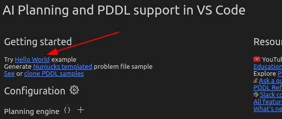

# Download and Install solvers in VScode to work with PDDL

## Install and Configure PDDL plugin in your Visual Studio Code

- In your **VScode extension** search **PDDL** plugins, after must accept all recommendations in the Overview page.

## Create first project &quot;Hello World&quot;

- Click in &quot;Hello World&quot; options and select a folder where you save your first project. Or download the **HelloWorld project** or others projects at this [Link](https://github.com/hpaucar/autonomous-system-repo).

### To execute in VScode
- To execute your project, select the problem.pddl file and right click and choose &quot;PDDL: Run the planner and display the plan&quot;.
- You have to watch a tab where you display the actions order from first state to last state.

## For optimizations projects that use minimize or maximize.

- Download the next solvers. These solvers was tested in Ubuntu 20.04
- Choose your version: to [32bits](https://drive.google.com/file/d/1u2yJTUpDOPD0YoyfRjwhTgkWW5sfZWmQ/view?usp=sharing) and [64bits](https://drive.google.com/file/d/1KSKZQ6PBbsavlJTxEhQLkq6sJ6nE1nQR/view?usp=sharing)
- Unzip the zip files in your workspace and open the folder in your terminal
- Use the next command to execute the solvers. For example, the most common solver is optic-cpl.

`$ ./optic-clp <domain_path.pddl> <problem_path.pddl>`

### If you want execute with others solvers how:

- FD-FDSS
- FD-LMCUT
- FD-MS
- FF
- LAMA
- MERCURY
- PLAN-OPTIC
- PROBE
- SYMBA
- YAHSP3

Use:

`$ ./plan-all <domain_path.pddl> <problem_path.pddl> <folder_to_output_result_path>`

## Using GUI of Visual Studio Code

- First select the "View>>Command Palette" and write "PDDL:Show overview page"
- In this page choose (+) button and select the run file(optic-clp) that is found in your folder from solvers.

- Finally make the same to execute pddl projects, i.e. right click and select PDDL:run ...
